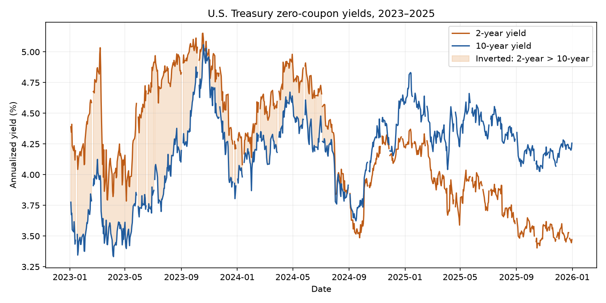

# IDS 706: Treasury Yield Analysis

I picked Treasury yields because I wanted a small dataset related to bonds. My main question was how the 2-year and 10-year yields changed between 2023 and 2025, especially when the 2-year yield was higher.

## Data and setup

Source: [Federal Reserve GSW yield curve data](https://www.federalreserve.gov/data/nominal-yield-curve.htm) ([CSV](https://www.federalreserve.gov/data/yield-curve-tables/feds200628.csv)). The file in `data/` contains 783 dates from 2023–2025 and five yield columns: 1, 2, 5, 10, and 30 years.

These are fitted, continuously compounded zero-coupon yields. Values are annual percentages: `4.25` means 4.25%. The Fed can revise the source, so the copy used here is included, with source details in `data/source_metadata.json`.

Use Python 3.10 or newer. From the project folder:

```sh
python3 -m venv .venv
source .venv/bin/activate
python -m pip install -r requirements.txt
python analysis.py
python compare_polars.py
```

The scripts print the results, and `analysis.py` saves the plot in `figures/`. No data download is needed.

## Data checks and findings

I loaded the CSV with Pandas, parsed the dates, and checked `head()`, `info()`, `describe()`, shape, missing values, and duplicates. There are 749 complete rows, 34 rows missing all five yields, and no duplicate rows or dates. The CSV is unchanged; each calculation drops rows missing the yields it needs.

I calculated `spread = yield_10y - yield_2y`. A negative spread means the 2-year yield is higher. Filtering for negative spreads in 2023 returned 250 dates. I then used `groupby("year").agg(...)` to compare years:

| Year | Valid dates | Mean spread (percentage points) | Inverted dates |
| --- | ---: | ---: | ---: |
| 2023 | 250 | -0.5896 | 250 |
| 2024 | 250 | -0.1288 | 165 |
| 2025 | 249 | 0.5458 | 0 |

The 2-year yield was higher on every valid date in 2023, less often in 2024, and on none in 2025. I used a line plot to show when the yields changed order. Shading marks inversion, and missing values remain gaps.



## Linear regression

I tried `LinearRegression` with the current 10-year yield as the input and the next observed 10-year yield as the target. After sorting and dropping missing values, `shift(-1)` creates the target. The final row has no target, so it is removed. “Next observed” is not always the next calendar day.

The split uses the target date: 2023–2024 for training (499 samples), and 2025 for testing (249 samples). This keeps 2025 target values out of training.

Test MAE was **0.0404 percentage points**, about 4 basis points. This is the average absolute prediction error. The script also prints five actual and predicted values. I have not compared the model with simply using the current yield as the next prediction, so this error alone does not show whether the regression adds value.

## Pandas vs. Polars

`compare_polars.py` repeats the filtering and yearly summary in both libraries. The 250 filtered dates match, and the yearly statistics agree within floating-point tolerance.

In Polars, `drop_nulls()` replaces `dropna()`, `with_columns()` adds columns using expressions such as `pl.col("yield_10y")`, and `group_by()` replaces `groupby()`. Filtering uses `.filter(condition)` instead of Pandas' `df[condition]`.

After a warm-up, I timed 5 batches of 100 runs and took the median batch time divided by 100. Timing covers dropping missing values, creating columns, filtering, grouping, and sorting. CSV loading and result checks are outside the timer.

| Library | Version | Example time per run |
| --- | --- | ---: |
| Pandas | 3.0.5 | 2.454 ms |
| Polars | 1.44.2 | 1.057 ms |

These results used Python 3.14.3 on an Apple Silicon Mac. Polars was faster in this run, but both took only a few milliseconds. The dataset is small, and timings vary between runs.

## Rust exercises

`rust_vs_python_intro.ipynb` is adapted from the [course notebook](https://github.com/Kedar-V/data-processing-frameworks-demo/blob/75772a44ed1cbc61e66396fad49a9aa0c913c8ef/notebooks/rust_vs_python_intro.ipynb). It has three short experiments:

- **Mutability:** change a cutoff from 1000 to 2000 by adding `mut`.
- **Ownership:** try using a moved vector, then use `clone()` and check that changing the copy leaves the original alone.
- **Borrowing:** try removing values while reading a vector, then fix the conflict by writing to a separate vector.

All six code cells were executed and have saved outputs. Three intentionally show compiler errors (E0384, E0382, E0502), each followed by a working version and a short explanation.

Choose the **Rust** kernel and continue past the error examples when rerunning. The [course setup guide](https://github.com/Kedar-V/data-processing-frameworks-demo/blob/master/SETUP.md) covers installation. No data files are needed for this notebook.
