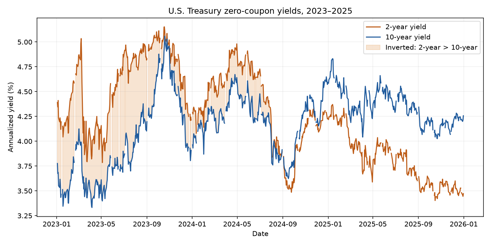
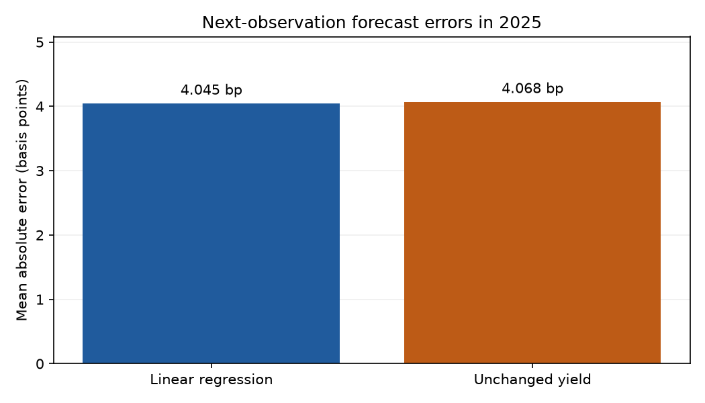
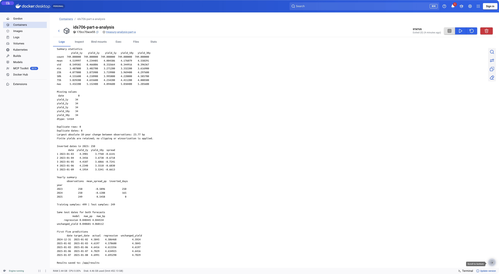
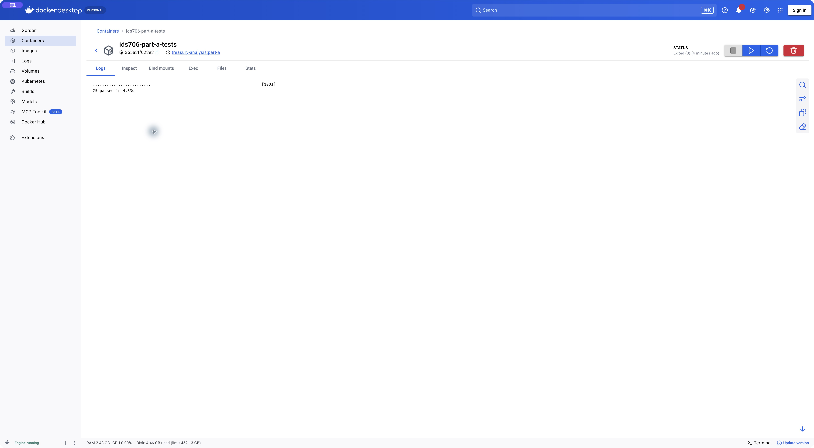

# IDS 706: Treasury Yield Analysis

[](https://github.com/whraw76/IDS706-W2-Treasury-Analysis/actions/workflows/tests.yml)

How did the 2-year/10-year Treasury spread change from 2023 to 2025, and does a simple regression predict the next observed 10-year yield better than keeping today's yield unchanged?

## Data and findings

The bundled [Federal Reserve GSW data](https://www.federalreserve.gov/data/nominal-yield-curve.htm) contains 783 dates and five maturities. These are fitted, continuously compounded zero-coupon yields, expressed as annual percentages. Source details and checksums are in [data/source_metadata.json](data/source_metadata.json).

There are 749 complete observations, 34 rows missing all five yields, and no duplicate dates. The original CSV is unchanged. Calculations exclude rows missing the fields they need, and plots leave gaps. The loader rejects missing or duplicate dates, nonnumeric yields, and infinities. Finite values are kept without clipping or filling: the largest observed 10-year yield change is 23.77 basis points, which could reflect a real market move.

The spread is 10-year minus 2-year yield. A negative value means inversion.

| Year | Observations | Mean spread (percentage points) | Inverted observations |
| --- | ---: | ---: | ---: |
| 2023 | 250 | -0.5896 | 250 |
| 2024 | 250 | -0.1288 | 165 |
| 2025 | 249 | 0.5458 | 0 |

Inversion was present on every valid observation in 2023, became less frequent in 2024, and was absent in 2025.



## Comparing forecasts

The regression uses the current 10-year yield to predict the next observed yield. The baseline simply predicts the current yield again. Both use the same 249 test observations.

Samples are split by **target date**: 499 training samples before January 1, 2025, and 249 test samples from that date onward. This keeps future target values out of training. The fitted model stays fixed during testing; each prediction uses the latest observed yield.

| Forecast | Test MAE (percentage points) | Test MAE (basis points) |
| --- | ---: | ---: |
| Linear regression | 0.040445 | 4.044534 |
| Unchanged yield | 0.040681 | 4.068112 |

Regression improves MAE by only about **0.024 basis points**, so the two forecasts are very similar in this test period. This result does not establish a useful trading strategy: there is no transaction-cost or statistical significance test. Fed estimates can be revised, so this saved snapshot does not establish what data were available on each historical date.



The exact scores and individual forecasts are saved in [model_comparison.csv](results/model_comparison.csv) and [predictions.csv](results/predictions.csv). One percentage point equals 100 basis points; “next observed” can span weekends or missing dates.

## Run locally

Use Python 3.13 or 3.14, from the repository folder:

```sh
python3 -m venv .venv
source .venv/bin/activate
python -m pip install -r requirements-dev.txt
make run
make check
python compare_polars.py
```

`make check` checks Black formatting, runs flake8, and runs pytest. Use `make format` to apply formatting. No download of Treasury data is needed. To choose another output folder:

```sh
python analysis.py --output-dir "/tmp/treasury results"
```

Dependencies are unpinned. The saved dataset and Docker image support reruns, but installing dependencies or rebuilding the image later may use newer package versions.

## Refactoring and testing

Previously, `train_model()` prepared samples, split dates, fitted the model, evaluated it, and printed results. These steps are now separate functions so the date split and evaluation can be tested directly. The Pandas comparison also reuses `filter_and_group()` instead of repeating the calculation. An output-directory argument lets the same script save results locally or through a Docker volume.

The suite has **24 unit cases and one system test**. It covers valid and invalid inputs, missing observations, the train/test date boundary, forecast errors and units, Pandas/Polars agreement, and plotted values. The system test runs the script from another folder, checks the saved forecasts and both images, and confirms the input CSV is unchanged.

On October 2, 2026, all **25 tests passed locally on Python 3.13 and 3.14, and inside the Docker image**. Black and flake8 also passed.

The updated CI workflow tests Python 3.13 and 3.14 on Ubuntu, checks formatting/linting, and separately builds and runs Docker. It triggers on pushes, pull requests, manual runs and Mondays at 13:17 UTC. The new workflow still needs verification on GitHub after publication; the badge currently reflects the published branch.

## Docker

Start Docker Desktop, then:

```sh
docker build -t treasury-analysis:part-a .
mkdir -p results
docker run --rm -v "$PWD/results:/app/results" treasury-analysis:part-a
docker run --rm treasury-analysis:part-a python -m pytest -v
```

Or use `make docker-build`, `make docker-run` and `make docker-test`.

The image includes Python, dependencies, the CSV, and tests. Building creates the image; running starts a container from it. The volume mapping keeps the output files on the host after the container is removed. This script finishes with exit code 0 and needs neither a port nor Compose.

Docker Desktop screenshots show the completed analysis and test runs. “Exited (0)” means successful completion.





## Files and earlier work

- `analysis.py`: loading, analysis, model comparison and charts.
- `compare_polars.py`: Pandas/Polars result and timing comparison.
- `tests/`: unit and full-script tests.
- `results/`: current charts, scores and predictions.
- `Dockerfile`, `.dockerignore`, `Makefile`: reproducible run commands.
- `.github/workflows/tests.yml`: CI checks.
- `docs/screenshots/`: execution evidence; older CI screenshots show the previous ten-test version.
- `rust_vs_python_intro.ipynb`: the earlier mutability, ownership and borrowing exercises, adapted from the [course notebook](https://github.com/Kedar-V/data-processing-frameworks-demo/blob/75772a44ed1cbc61e66396fad49a9aa0c913c8ef/notebooks/rust_vs_python_intro.ipynb), including intentional errors followed by fixes. It uses a Rust kernel and is outside the Python test suite.

AI assistance: Codex helped with the refactoring, tests, documentation, and the suggestion to compare regression against an unchanged-yield baseline.

Before final submission, publish and verify the new CI run, and add the required GitHub commit-diff screenshot for the refactoring.
